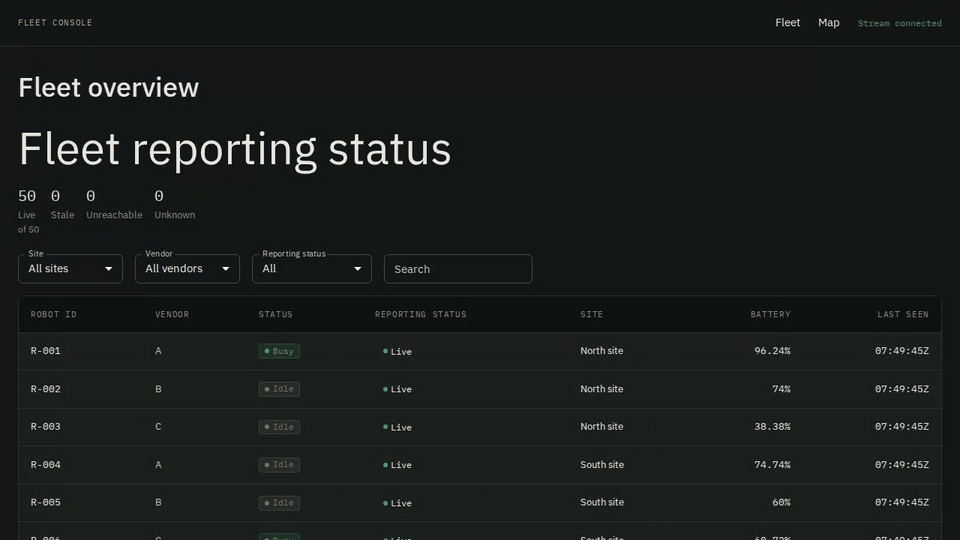

# Fleet Console

Multi-vendor robot fleet telemetry console. Canonical contracts, vendor adapters, thin simulator/server, React + Material UI console.

```bash
pnpm install
pnpm dev        # console on http://localhost:5173, server and simulator alongside
```

See it, don't read it: [`./demo/demo.sh`](demo/demo.sh) is a guided walkthrough that
starts, faults, and restarts the stack itself; [`demo/DEMO.md`](demo/DEMO.md) is the
same demo as a narrated script. What to watch in the first thirty seconds is in
[section 2](#2-run-it).



_Three robots silenced with `--drop`: their rows degrade `LIVE → STALE → UNREACHABLE` on
the server's freshness sweep **while the stream stays connected** and the other 47 stay
live. Caused by message absence, detected by a timer, never recomputed by the client._

**The brief's three questions:**

- **What I chose to build and why** — all three parts, as one vertical slice, with the
  UI carrying the weight. [Section 5](#5-scope).
- **What I faked or left out, and why that was the right trade** — nothing is mocked;
  the simulator and server are real but deliberately thin. The cuts, each with its
  reason, are [section 9](#9-not-built).
- **What I would do differently with more time or in production** —
  [section 10](#10-what-i-would-change), including the mistakes; section 9 names what
  production would require first (auth, persistence, horizontal scale).

**Project Core:**

1. The UI never presents stale data as current. This is enforced by tooling and intended to survive team turnover/agent-written code (Principle 4).
2. Vendor differences are normalized where shared. These differences are preserved as declared capabilities where not shared
   (flattening differences deletes the product) (Principle 3).

Sections 2-3 cover "freshness"; 4 covers normalization; 7 covers scale.

---

## 1. Architecture

Fleet operators watch robots from three manufacturers with different schemas. The console shows one coherent fleet, explicit about data age and machine capabilities.

Two problems:

- **Silence is an event:** "Freshness" derived by a recurring server sweep, not on arrival. Robots degrade `LIVE` → `STALE` → `UNREACHABLE` autonomously. Systems reacting only to arrivals miss silence, showing stale data as current. The console displays what the sweep determined and never recomputes it (ADR 3).
- **Vendors disagree:** Three schemas normalized into a canonical envelope (core shared data) + declared capabilities. UI renders from declarations, not hard-coded lists.

```text
 Vendor Simulators
         |
 Vendor-Specific Adapters
         |
 Canonical Telemetry Model
         |
 Fleet State + Business Rules
         |
    +----+----------------+
    |                     |
 HTTP Snapshot      WebSocket Updates
    |                     |
    +----------+----------+
               |
       React Client State
               |
      +--------+--------+
      |        |        |
    Fleet     Map    Robot Detail
```

**Surfaces**, in full in [`packages/server/README.md`](packages/server/README.md) and [`packages/web/README.md`](packages/web/README.md):

| Surface          | Routes                                                                                                                                  |
| ---------------- | --------------------------------------------------------------------------------------------------------------------------------------- |
| Console (`/web`) | `/` fleet table · `/map` site map · `/robots/:id` robot detail · `/dev/ui` component gallery (dev builds only)                          |
| API (`/server`)  | `POST /api/telemetry/:vendor` · `GET /api/fleet` · `GET /api/robots/:id` · `GET /api/robots/:id/history` · `GET /api/health` · `WS /ws` |

|             |                                                                                                                                                                                                                                                |
| ----------- | ---------------------------------------------------------------------------------------------------------------------------------------------------------------------------------------------------------------------------------------------- |
| Stack       | React · TypeScript · Vite · Material UI with design-token layer                                                                                                                                                                                |
| Layout      | pnpm workspace; web package in the community-standard React layout — `features/`, `components/`, `hooks/`, `stores/`, `context/`, `lib/`, `utils/`, `types/` (ADR 36; folder map in [`packages/web/README.md`](packages/web/README.md))        |
| Enforcement | `eslint-plugin-boundaries`, token/hex lint, `strictTypeChecked`, CI (Principle 15)                                                                                                                                                             |
| Specs       | [`PRINCIPLES.md`](PRINCIPLES.md) · [ADRs](docs/00_adr/) · [decision index](docs/PENDING_ARCHITECTURE_DECISIONS.md) · [page specs](docs/01_page-specs/) · [component specs](docs/02_component-specs/) · [package specs](docs/03_package-specs/) |
| Design      | [design system](docs/DESIGN_SYSTEM.md) · [wireframes](docs/WIREFRAMES.md)                                                                                                                                                                      |
| Records     | [architecture audit](docs/ARCHITECTURE_AUDIT.md) · [archive](docs/04_archive/)                                                                                                                                                                 |

```
/packages
  /contracts    canonical envelope, capability types, freshness machine, Zod schemas (Principle 2)
  /adapters     one module per vendor dialect, plus recorded vendor fixtures (Principle 2, 3)
                A/B/C schemas, registry, unknown-field ledger, recorded fixtures and
                public `testing` subpath
  /simulator    multi-vendor telemetry producer with fault injection
  /server       ingest, adapter dispatch, current state, battery history, WebSocket fan-out, health
                runnable HTTP/WebSocket process; slow-client policy remains trigger-deferred
  /web          the console — primary deliverable
PRINCIPLES.md   binding engineering principles
AGENTS.md       normative agent routing and hard rules (Principle 14)
CLAUDE.md       compatibility pointer to AGENTS.md
/docs/00_adr    architecture decision records
```

`/adapters` is a standalone package: it's a contract boundary, changes most often, and must be testable/versionable without touching the dispatcher. Adding a vendor = 1 module + 1 fixture. Zero canonical model edits.

### Updating architecture decisions

Numbered ADRs are the normative decision records. `docs/decisions.json` routes decision
IDs to those ADRs, and `docs/PENDING_ARCHITECTURE_DECISIONS.md` is a generated index; do
not edit the index directly. CI checks their consistency on every change. To update a
decision:

1. Edit the normative ADR and its entry in `docs/decisions.json`.
2. Run `pnpm docs:decisions` to regenerate the decision index.
3. Run `pnpm check:architecture-docs` before committing.

---

## 2. Run it

```bash
pnpm install
pnpm dev
```

**One command starts all three, connected.** Root `dev` is
`pnpm --recursive --parallel --stream dev`, and `server`, `simulator` and `web` each
define one. Verified on 20 August 2026: the server logs `server.listening` on
`127.0.0.1:8080` with 5 routes and the shipped freshness policy, the console comes up on
`http://localhost:5173` and proxies `/api` and `/ws` to the server, and the simulator
POSTs into the real ingest — 1,993 readings sent and 1,993 accepted over 40 seconds,
with no rejections and no server failures.

**What to look for in the first thirty seconds**, at `http://localhost:5173`:

1. **Summary strip:** Counts freshness only (`LIVE`, `STALE`, `UNREACHABLE`, `UNKNOWN`). Mutually exclusive, totals fleet exactly. No status duplication. Headed "Fleet reporting status" while the stream is connected; during an outage the counts stay visible under "Fleet reporting status · last known", so the group never asserts a currency the socket cannot support (ADR 23).
2. **Rows:** Show status + freshness. Non-`LIVE` rows use outline status chips (`(last known)`) and em-dash batteries (no stale numbers presented as current). The connection state is supplied by a real socket, so the labels render while the stream is connected and are suppressed while it is not (ADR 3) — watched in a browser by the Playwright outage scenario, which kills the server and asserts the suppression, the retained rows, and the qualified summary heading (ADR 32).
3. **Vendor column:** Filter to Vendor C vs A. Capability panels differ because robots differ.

Within the first ten seconds the summary counts down from `Unknown: 50` as robots report
in and rows turn `LIVE`; by thirty seconds the whole fleet is live and the vendor column
shows all three dialects rendered from one table with no vendor branch.

For the guided demonstration — including the cold-start act that `pnpm dev` skips,
because it starts the simulator immediately — use `./demo/demo.sh` or the three-terminal
start in [`demo/DEMO.md`](demo/DEMO.md).

### Tenants, endpoints, CORS

The web tenant is selected at build time with `VITE_TENANT=tenant-a|tenant-b`; omitting
it selects tenant A. For example, `VITE_TENANT=tenant-b pnpm --filter web build` produces
the Tenant B bundle. Unknown values fail the build rather than silently falling back
(ADR 17). To see Tenant B against the same live stack, run `pnpm dev:tenant-b` — the
"Northwind Robotics" wordmark, the light theme, and a robot-detail page without the
lidar-health panel are the three visible differences; `pnpm test:e2e:tenant` asserts the
same three on the production bundle in Chromium.

D13 is settled as **Option 2 — environment variables at server startup plus a Vite dev
proxy, with strict startup validation**
([ADR 21](docs/00_adr/21_ENDPOINTS_FROM_THE_ENVIRONMENT_WITH_A_DEV_PROXY.md)). The server
and development proxy both default to `127.0.0.1:8080`. Override them together with
`FLEET_SERVER_HOST` and `FLEET_SERVER_PORT`; set `FLEET_ALLOWED_ORIGINS` to a
comma-separated list of exact origins only for a cross-origin production deployment.
Present-but-invalid values fail startup rather than being coerced or silently defaulted.

Both shipped consoles call same-origin `/api` and `/ws`, which Vite proxies in development,
so CORS is intentionally not exercised there. Serving the console from a different origin
than the API is the decision's falsifier: that deployment must configure the allow-list and
add integration coverage for accepted and rejected cross-origin requests.

---

## 3. Demo script

The canonical demo script is [`demo/DEMO.md`](demo/DEMO.md) — seven acts with per-act
frontend notes, plus [`demo/demo.sh`](demo/demo.sh), an interactive driver that starts,
faults, and restarts the stack itself. The sequence below condenses its core (Acts 2–6)
for a reader who wants the shape without the narration; the two moments that carry the
submission are the capability comparison (step 2) and the degradation contrast
(steps 4–5).

**Observed in a browser on 20 August 2026.** Headless Chrome against the running stack, at
`http://localhost:5173`:

| Moment                  | Rendered freshness         | Banner                |
| ----------------------- | -------------------------- | --------------------- |
| Simulator running       | `{Live: 46, Stale: 4}`     | `Stream connected`    |
| Simulator stopped, +12s | `{Unreachable: 50}`        | `Stream connected`    |
| Server stopped          | no per-robot labels at all | `Stream reconnecting` |

Rows carried all three dialects normalised — `R-001 A … 93.46%`, `R-002 B … 72%`,
`R-003 C … 35.53%` — from one table with no vendor branch.

**That contrast is the demo.** Steps 4 and 5 are different failures on purpose, and the
middle and bottom rows above are what tells them apart: a robot going silent degrades to
`UNREACHABLE` **while the stream stays connected**, because the server still has a current
answer about it; the console going blind suppresses every per-robot label and says so at
the connection level instead. Deriving freshness server-side is what makes those two
distinguishable at all.

Every step of it is now committed automation
([ADR 32](docs/00_adr/32_BROWSER_EVIDENCE_WITH_PLAYWRIGHT_AGAINST_THE_REAL_STACK.md)):
`pnpm test:e2e` drives the real server, simulator, and built console through these
scenarios in Chromium, Firefox, and (in CI) WebKit.

Sequence to watch:

1. Open fleet (50 robots). All `LIVE`.
2. Compare capability panels across all three vendors: A shows dock + lidar-health, B shows dock alone, C shows dock + water-level. Confirmed against the real adapters on 20 August 2026 — decoding the recorded payloads yields `A: dock+lidarHealth+sequence`, `B: dock`, `C: dock+sequence+waterLevel` — and the console's fixtures were corrected to match, closing `packages/FIXME.md` **F1**. Three vendors, three distinct panel sections. Absence is the interface (no disabled placeholders). Cannot offer unsupported actions.
3. Simulator `--drop` 3 robots (`R-007,R-023,R-041` — ids must exist in the 50-robot default fleet; an unknown id fails at startup rather than silently dropping nothing). No message sent to console. **Run the simulator once _without_ the flag first.** A cold start with `--drop` leaves those three at `UNKNOWN` rather than degrading them, because they never reported at all and `UNKNOWN` is the honest state for a robot nobody has heard from (ADR 3). The `LIVE → STALE → UNREACHABLE` transition needs them to have been live first, and following step 3 from a cold fleet is the one way to make this demo look broken when it is working.
4. Watch 3 rows degrade on the server sweep (`STALE` → `UNREACHABLE`). Others stay `LIVE`. Status chips hollow, batteries em-dash. Caused by message absence. **Verified against a running stack on 20 August 2026**: after a normal run followed by a `--drop` run, `GET /api/fleet` reported `{live: 47, unreachable: 3}` with `R-007`, `R-023` and `R-041` the only unreachable robots. The browser half is a committed Playwright scenario: silence the simulator and watch `R-001`'s row render `Live` → `Stale` → `Unreachable` while the banner stays `Stream connected` (ADR 32).
5. Kill stream. Connection banner appears, table retains last-known data, per-robot freshness labels are suppressed. **Built, observed on 20 August 2026 against the running stack, and committed as a Playwright scenario (ADR 32): rows retained, freshness suppressed, banner honest.** Connection state travels through `ConnectionContext`, both pages render `FreshnessLabel` only while the real socket is connected, and the default remains fail-closed at `disconnected` ([ADR 23](docs/00_adr/23_CONNECTION_STATE_TRAVELS_THROUGH_SHARED_LIB.md)). With no live connection the console has no current per-robot answer and says so at the connection level rather than guessing per row (ADR 3).
6. Restore stream. Labels return; rows resume degrading on the sweep (no reload). **The server half was observed on 20 August 2026**: robots that had aged to `UNREACHABLE` while the simulator was stopped returned to `LIVE` within seconds of it resuming, with no server restart. **The console half is implemented under [ADR 31](docs/00_adr/31_JITTERED_RECONNECT_AND_SERVER_SESSION_RECONCILIATION.md)**: the transport reconnects automatically on a full-jitter schedule and detects a restarted server by its `serverSessionId`, replacing its picture from the new snapshot without reload or manual retry. Proven at unit and process boundaries (`fleetTransport.test.ts`, `runServer.test.ts`) and now in real browsers: the committed restart scenario kills the server, starts a new process, and watches the console re-join and resume live rows without Retry or reload (`packages/web/e2e/smoke.spec.ts`, ADR 32).

Steps 4 and 5 are different failures on purpose: 4 is a robot going silent, 5 is the console going blind. Deriving freshness server-side is what lets the console tell them apart.

Simulator commands for the steps above (verified against `packages/simulator`: the
default fleet is 50 robots at 1 Hz, ids run `R-001`-`R-050`, and `--drop` validates
its ids against the built fleet before any timer starts):

```bash
# Step 1 — the demo workload: 50 robots, 1 Hz each
pnpm --filter @fleet/simulator start

# Step 3 — three robots go silent; the process and every other robot stay healthy
pnpm --filter @fleet/simulator start -- --drop R-007,R-023,R-041

# Step 6 — recovery is a restart without the flag; dropped robots resume where they stopped
pnpm --filter @fleet/simulator start
```

`--hz` is per robot, so the load profile is `--robots 500 --hz 5` (~2,500 req/s) — but
**not verbatim against a default stack**: the server accepts only robots listed in its
manifest, and the committed `config/fleet-manifest.json` holds 50, so the other 450
robots would draw 404s (~2,250/s) and the table would never grow past 50. Generate a
500-robot manifest with `--print-manifest`, swap it in for the committed file, and
restart the server first — `demo/demo.sh` does exactly this automatically and restores
the committed manifest on exit, and [`demo/DEMO.md`](demo/DEMO.md) Act 7 documents the
manual swap. See [`packages/simulator/README.md`](packages/simulator/README.md) for
every flag.

---

## 4. Vendors & Adapter Layer

Multi-manufacturer normalization is the business. 3 producers disagree on purpose.

| Dialect      | How it differs                                                                                                                                                                            |
| ------------ | ----------------------------------------------------------------------------------------------------------------------------------------------------------------------------------------- |
| **Vendor A** | Nested payload · battery 0–1 fraction · position in meters · ISO 8601 timestamps · status enum `idle` / `busy` / `charging` / `fault`                                                     |
| **Vendor B** | Flat payload · battery int percentage · position in cm · epoch-ms timestamps · status numeric code · **no sequence** (adapter synthesizes ordering from timestamp) · declares `dock` only |
| **Vendor C** | Like A, but declares `waterLevel`, omits `lidarHealth`, sends undocumented field                                                                                                          |

**Adapter jobs:** Identify, convert telemetry/errors to envelope, declare capabilities, retain raw payload for diagnosis (hidden from read model).
**Canonical envelope:** schema version, robot/site/vendor/model identity, adapter id and version, `reportedAt` and `receivedAt`, normalized core, server-derived freshness, capability record. Core: connectivity, battery, position, status, health.

Two corrections against ADR 1, which is the current authority: **sequence** is a declared capability rather than an envelope field, because Vendor B sends none; and **raw payload** is excluded from the fleet read model and the delta stream, served only on the single-robot endpoint as a separate boundary type. `@fleet/contracts` rejects an envelope carrying either, which is what makes the exclusion checkable rather than a convention.

**Consequences:**

- **Capabilities drive UI, not vendor names.** `if (vendor === …)` in `features/` is a defect (Principle 3).
- **Unknown fields counted.** Vendor C's undocumented field increments a per-adapter counter on `GET /api/health`. Quietly discarding data rots integrations. Measured on a 40-second `pnpm dev` run: `telemetry.firmware_channel` counted **235** times under vendor C, with vendor A and B at zero — the count is per adapter and fleet-wide, and the response says so in `unknownFieldScope` rather than in a caption ([ADR 15](docs/00_adr/15_UNKNOWN_FIELD_ACCOUNTING_ON_ACCEPTED_PAYLOADS.md), [ADR 25](docs/00_adr/25_CONTRACTS_OWNS_EVERY_DECODED_RESPONSE_COUNTERS_BY_SCOPE.md)).
- **Sequence regressions are rejected and reported safely.** A lower reliable sequence
  leaves accepted state, diagnostics, history, deltas, and health counters unchanged and
  emits one `telemetry.sequence_regression` warning with canonical ids, both sequence
  values, and server receipt time—never raw payload or vendor prose. The public health
  counter remains deferred until a real diagnostics consumer requires contract versioning.
- **Vendor B's synthesized sequence is weaker.** Timestamp ordering can not distinguish duplicates from same-ms events. Recorded as a known limitation.

Adapter contract tests verify normalization: recorded vendor payload → exact canonical event (Principle 10). `pnpm record:fixtures` records one representative payload per vendor from the simulator into `packages/adapters/src/vendors/*/__fixtures__/`, and CI fails if the tree produces a different byte ([ADR 13](docs/00_adr/13_RECORDED_FIXTURES_WITH_A_CI_DRIFT_GUARD.md)). Each vendor module decodes its own fixture to an exact canonical envelope, a cross-vendor test proves two dialects describing one state produce identical cores, and every malformed fixture returns a failure result rather than throwing. `packages/adapters` also ships the result type, the unknown-field ledger, the vendor union, the dispatch registry, and a public `testing` subpath ([ADR 11](docs/00_adr/11_PUBLIC_TESTING_SUBPATH_FOR_FIXTURES.md)) that `packages/server`'s ingest test consumes under a narrow lint exception.

**Site hierarchy:** 1 level (robots → sites). Extends rather than changes shape for org → site → building → fleet → robot. Site labels are deployment configuration: the manifest's `sites` directory travels on the fleet snapshot (schema version 3, ADR 34) and the console labels from it — North site, South site, East site in the shipped configuration — inventing nothing.

---

## 5. Scope

The brief allowed building any one of the three parts. I built the complete vertical
slice because the interesting questions are system-level: how telemetry crosses vendor
boundaries, where business rules live, and how operational state reaches a person who
has to act on it. Coding agents made the broader scope feasible; they did not remove
the need for architectural control, and testing that control was part of the point
(section 8).

The UI carries the most weight because operational state must be understandable, not
merely available — and because it is the best place to examine scalable component
architecture, state management, accessibility, and design-system discipline.

Four questions shaped every structural decision:

- How should an application be structured if it may grow into a SaaS platform?
- Which principles should exist from the first day?
- How can autonomous agents produce clean, maintainable software instead of slop?
- Which practices make sense at 4,000 components, even if they appear excessive in a
  small demo?

Initial goals, all of which survived into the tree: a complete working system;
multi-vendor telemetry normalized without hiding genuine differences; stale and missing
telemetry made visible; snapshot plus real-time delivery; a UI independent of vendor
payload formats; explicit architectural decisions; generated code kept reviewable; and
limitations documented instead of production readiness implied.

Unequal weighting: console is submission; simulator/server feed it.

| Package                   | Weight      | Why                                                                                 |
| ------------------------- | ----------- | ----------------------------------------------------------------------------------- |
| `/web`                    | Heaviest    | Deliverable. Structure, freshness honesty, capability rendering, personas, theming. |
| `/contracts`, `/adapters` | Substantial | Normalization argument & checkable adapter tests.                                   |
| `/server`, `/simulator`   | Thin        | Produce dialects, inject faults, fan out deltas. No more.                           |

Hours spent: **10–15**, against a brief that said "a few." The overage is deliberate:
the exercise, as framed, is about structure that still holds at 4,000 files, and the
enforcement, contracts, and decision records that argument needs are the slow part —
the features themselves are not where the time went.

Status as of 20 August 2026, verified against the tree and against one `pnpm dev` run. Cuts go in section 9.

| Built                                                         | Status                                                                                                                                                                                                                                                                                                                                                                                                             |
| ------------------------------------------------------------- | ------------------------------------------------------------------------------------------------------------------------------------------------------------------------------------------------------------------------------------------------------------------------------------------------------------------------------------------------------------------------------------------------------------------ |
| Canonical envelope + capability model + freshness machine     | **Built.** Schemas, capability wire codec, `deriveFreshness`, tests.                                                                                                                                                                                                                                                                                                                                               |
| Three vendor adapters + recorded fixtures + contract tests    | **Built.** A, B and C modules with per-vendor schemas, a dispatch registry, exact-output contract tests, and recorded fixtures drift-gated in CI (ADR 13) reachable through the public `testing` subpath (ADR 11).                                                                                                                                                                                                 |
| Simulator with vendor mix and fault-injection flags           | **Built.** Three dialects, `--drop`, seeded fleet, bounded transport, integration tests.                                                                                                                                                                                                                                                                                                                           |
| Server: ingest, dispatch, idempotent upsert, health endpoint  | **Built.** `POST /api/telemetry/:vendor` with the size cap ahead of the parse, registry dispatch, idempotent upsert, and `GET /api/fleet`, `/api/robots/:id`, `/api/robots/:id/history` and `/api/health`. The history route (**G4**) landed under ADR 33: compact retention at capacity 3,001 per robot, decimated to at most 60 extrema-preserving points over a fixed 60-second window.                         |
| WebSocket fan-out with coalescing                             | **Built.** One coalescing set per console, flushed at up to 10 Hz on `/ws`, sharing the server's one flush counter with the snapshot (ADR 18). No backpressure yet — deferred on ADR 8's open configuration question (**H6b**).                                                                                                                                                                                    |
| Fleet view: summary, filters, table                           | **Built**, reading the live store. Freshness summary, site/vendor/freshness/search filters, table.                                                                                                                                                                                                                                                                                                                 |
| Robot detail: capability panels, operator/technician personas | **Built**, reading `GET /api/robots/:id` and `/api/health`, plus the fetch-on-visit battery-history sparkline over `GET /api/robots/:id/history` (ADR 33). Live after the one fetch: core values and freshness update from stream deltas by reconciling this robot's fleet row over the fetched detail — no refetch, no re-render for other robots' deltas.                                                        |
| Connection-integrity handling                                 | **Built.** The banner, `ConnectionContext` and label suppression are driven by a real socket, failing closed to `disconnected` (ADR 23). Recovery is automatic under ADR 31 — full-jitter reconnect, capped initial probe, server-session restart detection — with manual retry for the terminal states. The restart recovery is committed browser automation against a real killed-and-restarted server (ADR 32). |
| Map view: site-faceted robot positions                        | **Built.** `/map` plots one site at a time as status-coloured, freshness-filled SVG markers over client-derived extents (page spec 04, ADR 35), with the side list as the sole activation path. Zero new dependencies; covered by unit, scale, and smoke browser tests.                                                                                                                                            |
| Tenant theming + one gated feature                            | **Built.** Build-time profiles are validated; Tenant B disables the lidar-health panel through `flags.lidarHealthPanel` (ADR 17).                                                                                                                                                                                                                                                                                  |
| Enforced dependency boundaries in lint and CI                 | **Built.** `eslint-plugin-boundaries` + resolver, violation fixtures, `.github/workflows/ci.yml`.                                                                                                                                                                                                                                                                                                                  |

---

## 6. Principles

[`PRINCIPLES.md`](PRINCIPLES.md) is binding. Every rule names an enforcement mechanism (static check, type, test, runtime, review). Review-only rules are conventions, not guarantees (Principle 15). The three that shaped this repository most:

- **§4 Provenance/Freshness:** Values carry source timestamps (`reportedAt` and `receivedAt`). Freshness is derived server-side from `receivedAt` against a configured policy, tested with an injected clock, and delivered as a field (ADR 3). The client displays; it never computes. Rejects absolute version: badges aren't needed everywhere, only at smallest scope needed to act.
- **§3 Canonical model:** Normalizes shared meaning, preserves differences as typed capabilities. Capabilities limit UI offerings, not server authorization or current availability.
- **§9 Boundaries:** `shared/ui` gets display data/callbacks only. No domain imports. No cross-feature imports. Lint-checked.

The remaining twelve — accessibility, security posture, design tokens, test discipline,
state separation, derived performance budgets, agent operability among them — are in the
document, each stating what it prevents and how it is enforced.

---

## 7. Scale (Holding at 4000 Files)

Feature-sliced, not type-sliced (`components/`, `hooks/` smear code across features).

```
/web/src
  /app        providers, router, shell
  /features   fleet · robot          (composition only)
  /entities   robot · site           (domain model, selectors — no JSX, no MUI)
  /shared     ui (pure, domain-free) · lib (formatting, time, transport)
                                        lib holds time, connection state, the stream
                                        client and the one decode boundary
  /config     tenant themes, feature flags
                                        build-time selected, schema-validated profiles
```

**Dependency rule:** `app` → any; `features` → `entities`, `shared`; `entities` → `shared`; `shared` → nothing up; no cross-feature (Principle 9).
**Enforcement:** Lint/CI tested. `__boundary-violation__/` tests cross-feature rejection + legal import non-error. Agent slop fails builds.
**Lint pass:** Rejects raw hex and `px`/`rem` literals plus numeric width/height-family values outside authored `styles/tokens.ts` (Principle 8), forbids `enum` (string-literal unions), and runs `strictTypeChecked` + `jsx-a11y` (Principle 6).
**Agent governance:** `CLAUDE.md`/`AGENTS.md` have hard rules + routing table (what → which package) (Principle 14). Per-package overrides alongside code. Symbols exported or re-exported by declared package entry points—and, in web, exports another layer imports or the app shell composes—get a 1-sentence doc comment; internal exports only where it earns its place (ADR 37). Cross-package coupling documented on both sides (searchable).
**ADRs:** Precede implementation. Amended under `## Observed consequences` if changed. Never claim ADR describes reality if diverged.
**Personas:** Operator summary default; technician diagnostics (raw payload, seq gaps, clock delta) behind toggle. 1 layout.
**White-label:** Config (`/config`), not conditionals (Principle 13). Theme, wordmark and features are selected together per build and validated at module load. `flags.lidarHealthPanel` is off for Tenant B; per-tenant component conditionals are defects. Config covers theming/features, NOT authorization (server concern, Principle 7). If that flag loses an owner without a replacement, ADR 17 requires removing the feature-flag claim rather than keeping an unnamed gate.

---

## 8. AI Usage

Coding agents wrote a large share of this code, and that was a deliberate part of the
exercise. The conversation behind this challenge raised a live problem — AI-generated
code becoming unmaintainable — and I had not worked in a codebase suffering from that
specific failure, so I used this project to test whether strong constraints could keep
a largely agent-generated application understandable.

The working rules:

- Agents were used for implementation speed; architectural authority stayed with me.
- Boundaries were defined before code was generated, and agents got narrow, reviewable
  tasks rather than open-ended ones.
- Assumptions had to be explicit, and unsupported abstractions were rejected.
- Agents could propose decisions but could not silently redefine the system.
  Significant decisions required recorded reasoning, alternatives, and consequences —
  that is what the ADRs are.
- Tests, linting, type checking, and CI were the enforcement mechanism, and the agent
  instructions (`AGENTS.md`, per-package `CLAUDE.md`) require them: generated code had
  to satisfy the repository, not merely appear correct.
- Every accepted line is my responsibility, and I do not accept an abstraction I cannot
  explain.

What this section does not claim: a per-file authorship ledger. That record was not
kept during the build, it is not recoverable from source or Git history after the fact,
and an inferred version would be indistinguishable from a measured one — so it is left
unwritten rather than reconstructed.

The structure exists to make agent code checkable regardless of who wrote it
(Principle 14):

- Boundary rule fails build (Principle 9).
- Token lint rejects agent hex literals (Principle 8).
- Contract tests pin canonical output (Principle 10).
- Doc comments ground next agent.

---

## 9. Not Built

| Cut                               | Reason                                                                                                                                                                                                                                                                                                                                                                              |
| --------------------------------- | ----------------------------------------------------------------------------------------------------------------------------------------------------------------------------------------------------------------------------------------------------------------------------------------------------------------------------------------------------------------------------------- |
| **Robot discovery/commissioning** | Highest-value front-end, cut because provisioning/credentials is a different exercise.                                                                                                                                                                                                                                                                                              |
| **Schema-driven config forms**    | Right answer for differing vendor schemas, cut for time. Capability model is foundation.                                                                                                                                                                                                                                                                                            |
| **Auth/multi-tenancy**            | Real tenancy is auth model, not filter. Config = theming/features only (Principle 7, 13). This is the demo-only security boundary: raw vendor payloads are served unauthenticated by recorded decision (ADR 26), the technician panel states the exposure on the surface, and production deployment remains blocked until authentication and authorization supersede that decision. |
| **Commands to robots**            | Requires state machine (requested, ack, executing, completed, failed, unknown) + audit (Principle 11). Fake buttons reporting unverifiable success violates anti-stale principle (Principle 4).                                                                                                                                                                                     |
| **Cloud/on-prem skew**            | Envelope has schema version for this, but full compatibility window out of scope.                                                                                                                                                                                                                                                                                                   |
| **Floor plans/calibration**       | Transform robot map → building drawing per site/floor is real problem. Positions shown native map frame + frame name. Abstract bounds used — the scheduled map view (page spec 04, ADR 35) derives its bounds from observed positions and still draws no floor plan.                                                                                                                |
| **Horizontal scale/broker**       | Correct at this size. Seam named: ingest stateless, state/fan-out partition. In-memory state won't scale across instances (Principle 12).                                                                                                                                                                                                                                           |
| **Alerting/escalation**           | Different product than live view.                                                                                                                                                                                                                                                                                                                                                   |
| **Persistent history**            | In-memory current state, rebuildable (Principle 11). History = bounded per-robot ring buffer of compact battery samples, served decimated for the sparkline. [ADR 6], amended by [ADR 33].                                                                                                                                                                                          |

---

## 10. What I Would Change

Not the same list as section 9 — those are things deliberately not built. These are
judgments about what exists.

- **The coalescing flush sends whole robot rows, not field-level deltas.** ADR 18 chose
  flush-sequence semantics first and deferred finer granularity until a measurement
  demanded it; the scale run then showed the un-virtualized table absorbing full-row
  deltas with the frame budget intact, so it stayed. It remains the first seam I would
  revisit if the fleet grew past the measured profile, and ADR 18 already names it.
- **The 500-robot load profile requires a manifest swap and a server restart.** The
  server rejecting unmanifested robots is correct; making the demo's own scale profile
  trip over that rule is friction. A server-side `--manifest` flag (or a committed
  500-robot manifest variant) would remove it. It stayed because it costs a restart,
  not correctness — `demo.sh` papers over it, and section 3 documents the manual swap.
- **`packages/README.md` drifted from the tree during the build** — it still claimed the
  server had no composition root a day after the composition root landed. In a
  repository whose thesis is that stale state must never present as current, the prose
  held itself to a lower standard than the fleet table. It is corrected now, but the
  honest fix at scale is generating such claims from the tree or not writing them.

### Mistakes

- I allowed the project to grow beyond the smallest useful demo, and it became harder
  to explain because it attempted to prove too much.
- Some governance arrived before the build had proven it necessary, and some
  documentation became more detailed than the implementation required.
- Some abstractions appeared before repeated use justified them.
- I did not constrain every agent task early enough, and some decisions were reviewed
  after implementation instead of before it.

### What I learned

- AI speed increases the cost of weak direction. Control comes from explicit
  constraints, and contracts are more useful than vague architectural guidance.
- Tests are effective instructions for humans and agents alike, and small tasks produce
  more reviewable changes.
- Decision records preserve context that code cannot, and maintainability depends on
  comprehension, not documentation volume.
- Real-time systems require explicit recovery behavior, and missing telemetry is still
  meaningful information.
- Normalization should preserve genuine differences, and production readiness consists
  of explicit engineering decisions — every accepted line and abstraction remains my
  responsibility.

---

## 11. Measurements

Every number below comes from a committed harness against the real stack; the full
tables, derivations, and caveats live in [`docs/MEASUREMENTS.md`](docs/MEASUREMENTS.md).
The headlines:

| What                                    | Measured                                                                | Harness                                                 |
| --------------------------------------- | ----------------------------------------------------------------------- | ------------------------------------------------------- |
| Ingest under concurrency, 500 robots    | 5,971 req/s at concurrency 128 — **zero late sweep ticks** at any level | `packages/server/src/freshness/sweepUnderLoad.test.ts`  |
| Validation cost per message             | 5.8 µs — transport dominates validation ~150×                           | `validationCost.test.ts` — **gate** at ADR 2's 400 µs   |
| Client at 500 robots, 10 Hz live stream | 120/120 frames applied at 9.78 Hz, delta-to-paint p95 50.5 ms           | `pnpm test:e2e:scale` (real Chromium, production build) |
| Console first load (JS + CSS)           | 182.52 kB gzip against a 300 kB budget                                  | `pnpm check:bundle` — **gate**                          |
| WCAG 2.2 AA contrast, every token       | all ratios clear 4.5:1 text / 3:1 non-text in both themes               | `pnpm check:tokens` — **gate**                          |

**The degradation point was not found on this machine, and that is stated as "not
reached," never "does not exist."** Ingest held zero late sweep ticks at 2.4× ADR 2's
design scale — the measurement that matters, because the freshness sweep stopping is
what would let stale robots report as LIVE — and the un-virtualized table held the frame
budget at 500 robots, which is the evidence ADR 24's virtualization deferral rests on.
What remains unmeasured (end-to-end ingest-to-paint latency, coalesced WebSocket rate
under real load, server memory over time) is named in
[`docs/MEASUREMENTS.md`](docs/MEASUREMENTS.md) rather than left as blank cells.

---

## 12. Testing

### Contributing: run the CI gates locally

Before pushing, run every merge-blocking check in one shot:

```bash
pnpm check:ci
```

The script mirrors `.github/workflows/ci.yml` in workflow order. Its expanded command list
is:

```bash
pnpm install --frozen-lockfile
pnpm check:architecture-docs
pnpm check:type-safety
pnpm check:doc-comments
pnpm check:tokens
pnpm check:dependencies
pnpm audit --audit-level=high --ignore-registry-errors
pnpm lint
pnpm typecheck
pnpm test
pnpm build
pnpm record:fixtures
git diff --exit-code -- 'packages/adapters/src/vendors/*/__fixtures__/*.json'
pnpm check:diff-size
pnpm check:bundle
```

`pnpm lint` includes the repository-wide Prettier check. The fixture command intentionally
modifies stale generated fixtures; commit those regenerated files rather than editing them
by hand. `check:diff-size` compares committed changes with the merge base, so CI is
authoritative for an uncommitted local tree; an indivisible change over the budget needs
the `Oversized-diff: <reason>` commit trailer documented by ADR 27.

CI also runs adapter coverage and writes it to the job summary, but that step is explicitly
report-only and does not gate a merge. A separate `browser-evidence` job runs
`pnpm test:e2e` across three engines and `pnpm test:e2e:scale`, uploading the report,
traces, and measurement JSON (ADR 32); it is not part of `check:ci` because it needs
Playwright's browsers installed. The workflow file remains the executable source of
truth if this list and CI ever disagree.

Deliberate scope (Principle 10). Built today:

- Envelope validation (valid, missing, malformed, boundary, unknown) — `packages/contracts`.
- Freshness machine (injected time, threshold boundaries) — `contracts` + the server sweep.
- No double-apply, no backwards state — `currentStateStore.test.ts` rejects duplicate and out-of-order sequences.
- Privacy-safe regression reporting — store, ingest, and live-composition tests prove one
  stable warning and no mutation or counter misclassification.
- Simulator HTTP delivery against a live receiver — `simulator/src/integration/ingest.integration.test.ts`.
- Boundary lint (violation fails, legal passes) — `__boundary-violation__` / `__enforcement__` suites in `web`, `server`, `adapters`.
- **No component snapshots** (asserts no-change, not correctness; trains blind diff acceptance). Verified: the repository contains no `.snap` files.

Named in the scope and now built:

- Adapter contract tests (recorded fixture → exact output), drift-gated in CI (ADR 13).
- Idempotent ingest at the HTTP boundary, over the store-level guarantee above.
- E2E (simulator → visibly stale row) **in a browser** ([ADR 32](docs/00_adr/32_BROWSER_EVIDENCE_WITH_PLAYWRIGHT_AGAINST_THE_REAL_STACK.md)). `pnpm test:e2e` runs the smoke suite per engine against the real server, simulator, and production bundle — rendering and streamed row updates, vendor normalization with capability panels, keyboard operability without focus theft, freshness degradation with the stream up, row retention with the server down, the battery-history chart surviving a robot going silent (ADR 33), automatic restart recovery, live robot detail updating from deltas without navigation, manifest-provided site labels and filters (ADR 34), a first-load server failure recovered through the visible retry, and a controlled malformed snapshot rendered as a terminal contract failure. `pnpm test:e2e:tenant` builds and drives the tenant-B production bundle in Chromium: light theme, disabled lidar panel, and narrow-viewport behavior (ADR 17). `pnpm test:e2e:scale` reports the 500-robot client measurement (integrity asserted, numbers reported, gated by nothing). Chromium and Firefox run anywhere; WebKit's system libraries are installed in CI (`--with-deps`), so a box without them proves two engines and leaves the third to the `browser-evidence` job.

Still explicitly **manual**: real screen-reader output and subjective forced-colors inspection (ADR 32 keeps them named rather than claimed).

## 13. Licence

[MIT.](./LICENSE)
